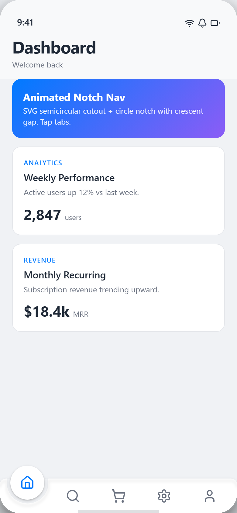
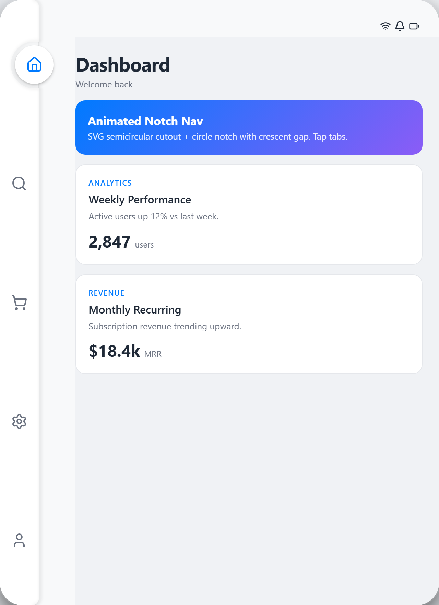
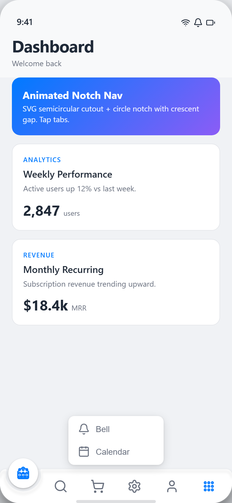
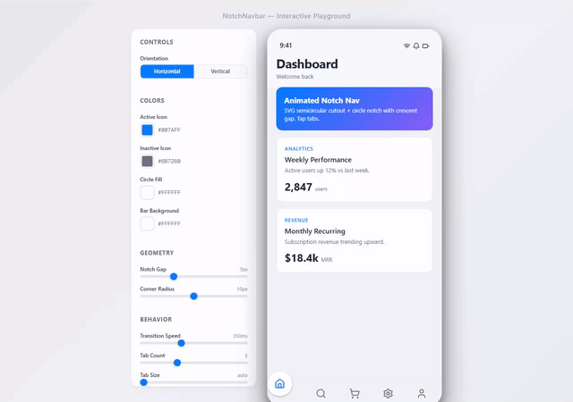

# NotchNavbar

[](https://www.npmjs.com/package/notch-navbar)
[](https://www.npmjs.com/package/notch-navbar)
[](LICENSE)
[](package.json)

Animated tab bar / sidebar component for React and Next.js with a sliding SVG semicircular notch cutout, concentric circle indicator, and cubic-bezier fillets.

Port of the [Mindinventory react-native-tabbar-interaction](https://github.com/Mindinventory/react-native-tabbar-interaction) concept to the web — pure SVG geometry, no canvas, no raster assets.

## Media / Demo

**Playground interactivo:** [http://localhost:3000](http://localhost:3000)

### Screenshots

| Horizontal — 5 tabs (default) | Vertical — sidebar | More Card — 7+ tabs |
|:---:|:---:|:---:|
|  |  |  |

### Demo



> Video full quality: [MP4](media/demo.mp4) · [WebM](media/demo.webm)

## Features

- **Sliding notch** — SVG `evenodd` rounded-rect with a concentric circular cutout that glides between tabs
- **Circle indicator** — white (configurable) circle with active icon, animated via `requestAnimationFrame`
- **Cubic fillets** — smooth bezier transitions from flat bar edge to the arc, no jagged corners
- **Bevel / 3D effect** — white highlight stroke + blurred shadow stroke for depth
- **Dual orientation** — bottom tab bar (`horizontal`) or side sidebar (`vertical`)
- **Dynamic menus** — auto-scales geometry when 7–10+ tabs; overflow tabs collapse into a "More" popover card
- **Keyboard accessible** — roving tabindex, arrow keys, Home/End, Enter/Space; popover uses menu/menuitem roles
- **Reduced motion** — respects `prefers-reduced-motion: reduce`
- **Glass morphism** — `backdrop-filter: blur(20px)` on the SVG bar
- **Next.js `<Link>` support** — optional `href` per tab renders a client-side link
- **Minimum tab guard** — renders "Add at least 2 tabs" when `tabs.length < 2`
- **Zero runtime deps for geometry** — pure math in `src/lib/notch/`, only React in the component

## Installation

```bash
npm install
```

### Peer dependencies

| Package | Purpose |
|---------|---------|
| `react` ≥ 18 | Component runtime |
| `react-dom` ≥ 18 | DOM renderer |
| `next` ≥ 13 (optional) | `<Link>` support when `href` is used |
| `framer-motion` | Dev playground only, not required by the component |
| `d3-shape` | Dev playground only, not required by the component |
| `d3-interpolate-path` | Dev playground only, not required by the component |
| `lucide-react` | Icons for the playground demo (your app can use any icon library) |
| `sass` | SCSS modules for styling |

The `NotchNavbar` component itself has **no** hard dependency on framer-motion, d3, or lucide. Only `react` and `sass` are required at build time.

## Quick Start

```tsx
import { NotchNavbar } from '@/components/notch-navbar/notch-navbar';
import { Home, Search, ShoppingCart, Settings, User } from 'lucide-react';
import type { NotchTab } from '@/lib/notch/types';

const tabs: NotchTab[] = [
  { name: 'Home',     activeIcon: <Home size={24} />,     inactiveIcon: <Home size={24} /> },
  { name: 'Search',   activeIcon: <Search size={24} />,   inactiveIcon: <Search size={24} /> },
  { name: 'Cart',     activeIcon: <ShoppingCart size={24} />, inactiveIcon: <ShoppingCart size={24} /> },
  { name: 'Settings', activeIcon: <Settings size={24} />, inactiveIcon: <Settings size={24} /> },
  { name: 'Profile',  activeIcon: <User size={24} />,     inactiveIcon: <User size={24} /> },
];

export default function Layout({ children }: { children: React.ReactNode }) {
  return (
    <div style={{ position: 'relative', minHeight: '100dvh' }}>
      {children}
      <NotchNavbar
        tabs={tabs}
        orientation="horizontal"
        onTabChange={(tab, i) => console.log(tab.name, i)}
      />
    </div>
  );
}
```

> **Note:** Icons must use `stroke="currentColor"` (lucide does this by default). The component sets icon color via CSS custom properties — it does not inject color props into your icon elements.

## API

### NotchNavbarProps

| Prop | Type | Default | Description |
|------|------|---------|-------------|
| `tabs` | `NotchTab[]` | *required* | Tab definitions. Each tab has `name`, `activeIcon`, `inactiveIcon`, and optional `href`. **Minimum 2 tabs** — if `tabs.length < 2`, renders a fallback message instead of the bar. |
| `onTabChange` | `(tab: NotchTab, index: number) => void` | `undefined` | Callback fired when the active tab changes. |
| `orientation` | `'horizontal' \| 'vertical'` | `'horizontal'` | `'horizontal'` = bottom bar, `'vertical'` = side sidebar. |
| `activeIconColor` | `string` | `'#007AFF'` | Color applied to the active icon (inside the circle). |
| `inactiveIconColor` | `string` | `'#6B7280'` | Color applied to all inactive icons in the bar row. |
| `circleFillColor` | `string` | `'#FFFFFF'` | Background color of the sliding circle. |
| `barBackground` | `string` | `'#FFFFFF'` | Fill color of the SVG bar/sidebar shape. |
| `cornerRadius` | `number` | `10` | Border-radius applied to all 4 corners of the bar. |
| `notchGap` | `number` | `7` | Gap in px between the cutout arc edge and the circle edge. |
| `circleSize` | `number` | `56` | Diameter of the sliding circle in px. |
| `barSize` | `number` | `56` | Bar thickness — height for horizontal, width for vertical. |
| `transitionSpeed` | `number` | `350` | Animation duration in ms (exponential ease-out). |
| `defaultActiveTabIndex` | `number` | `0` | Initially selected tab index. |
| `maxVisible` | `number` | `5` | Max visible tabs in the bar. Extra tabs go into a "More" popover card. |
| `moreLabel` | `string` | `'More'` | Label for the "More" tab (used as `aria-label`). |
| `moreIcon` | `ReactNode` | Inline 3×3 grid SVG | Icon for the "More" tab. Accepts any React node. |
| `containerWidth` | `number \| undefined` | `undefined` | Fixed width in px for horizontal mode. Omit for fluid width via `ResizeObserver`. |
| `containerHeight` | `number \| undefined` | `undefined` | Fixed height in px for vertical mode. Omit for fluid height via `ResizeObserver`. |
| `containerBottomSpace` | `number` | `0` | Bottom inset in px for horizontal mode (safe area offset). |
| `tabSize` | `number \| undefined` | `undefined` | Fixed tab slot size in px. When set, each tab occupies exactly this width/height with equal gaps. When omitted, tabs fill the bar evenly (`flex: 1`). |
| `className` | `string \| undefined` | `undefined` | Extra CSS class applied to the root `<nav>` element. |

### NotchTab

```ts
interface NotchTab {
  /** Unique tab identifier */
  name: string;
  /** Icon shown when tab is active (inside circle) */
  activeIcon: ReactNode;
  /** Icon shown when tab is inactive (inside bar) */
  inactiveIcon: ReactNode;
  /** Optional Next.js route — renders <Link> instead of <button> */
  href?: string;
}
```

## Icon Colors — `currentColor`

The component does **not** pass color props to icon elements. Instead it drives color through CSS custom properties:

- `--nn-active-icon-color` → set on the circle's SVG `<path>` and icon `<span>`
- `--nn-inactive-icon-color` → set on inactive icons in the bar row

For this to work, your icons **must** use `stroke="currentColor"`. Lucide icons do this out of the box. If you use custom SVG icons, add `stroke="currentColor"` to the root `<svg>` element.

**How colors apply:**

| Location | Color source |
|----------|-------------|
| Icon inside circle (active) | `activeIconColor` |
| Icons in bar row (inactive) | `inactiveIconColor` |
| Bar hover state | `activeIconColor` (via `:hover` rule) |

## Orientation

### Horizontal (default)

Bottom tab bar. The notch cutout is on the **top edge** of the bar. The circle sits above the bar, offset by `CENTER_OFFSET = 6px` from the top edge.

```
┌─────────────────────────────────┐
│          ┌──○──┐                │  ← circle (active icon)
│──────────┘     └────────────────│  ← bevel stroke
│    ●    ●    ●    ●    ●       │  ← icons in bar
└─────────────────────────────────┘
```

SVG geometry: `barPathH` → rounded rect with `evenodd` cutout on top. `bevelPathH` → top-edge stroke with cutout.

### Vertical

Side sidebar. The notch cutout is on the **right edge** (internal side). The circle sits to the right of the sidebar, offset by `CENTER_OFFSET = 6px` from the right edge.

```
┌──────┐ ──┐
│ ●    │   │
│──────┤ ○ │  ← circle (active icon)
│ ●    │   │
│──────┤───┘
│ ●    │
└──────┘
```

SVG geometry: `barPathV` → rounded rect with `evenodd` cutout on right. `bevelPathV` → right-edge stroke with cutout. The `x → SW - x` mirror ensures the cutout always faces inward.

### tabSize (vertical compact mode)

For vertical sidebars, `tabSize` lets you constrain each tab slot to a fixed pixel size instead of filling the sidebar height evenly. Useful for sidebars with few tabs that shouldn't spread across the full height.

## Dynamic Menus

### Auto-scale

When `tabs.length` exceeds `maxVisible`, the component renders a **"More" tab** instead of forcing all tabs into the bar. The geometry engine auto-adjusts so the circle and notch cutout fit cleanly regardless of tab count.

**Effective slot size** (horizontal: width, vertical: height):

```
slot = (containerSize − 2 × PAD) / barTabCount
```

Where `barTabCount = maxVisible + 1` (the extra slot is the More button). The circle and notch gap are clamped to fit inside this slot:

```
effectiveCircleR = min(circleR, slot/2 − 6)
effectiveGap     = min(notchGap, slot/2 − effectiveCircleR)
```

This means 7–10 tabs with `maxVisible=5` render with the same clean proportions as 5 tabs — no overflow, no clipping, no manual sizing.

### More card (overflow popover)

When `tabs.length > maxVisible`:

1. The first `maxVisible` tabs render normally in the bar.
2. A **More button** appears at position `maxVisible` with the `moreIcon` (default: 3×3 grid SVG).
3. Clicking / pressing Enter on More opens a **popover card** listing the remaining tabs as `menuitem` buttons.
4. `onTabChange` always fires with the **real index** (not the hidden index) — the consumer doesn't need to offset anything.
5. If a hidden tab is active, the More button shows that tab's `inactiveIcon` and has `aria-selected="true"`, so the user knows which overflow tab is selected.

**Keyboard behavior inside the popover:**

| Key | Action |
|-----|--------|
| `ArrowDown` / `ArrowRight` | Next item (wraps) |
| `ArrowUp` / `ArrowLeft` | Previous item (wraps) |
| `Home` / `End` | First / last item |
| `Enter` / `Space` | Select item, close popover |
| `Escape` | Close popover, focus returns to More button |
| Click outside | Close popover |

The popover uses `role="menu"` / `role="menuitem"` for screen readers.

### Use case: role-based tabs

Pass a dynamic `tabs` array based on user role — the component handles overflow automatically:

```tsx
const adminTabs: NotchTab[] = [
  { name: 'Dashboard', activeIcon: <LayoutDashboard size={24} />, inactiveIcon: <LayoutDashboard size={24} /> },
  { name: 'Users',     activeIcon: <Users size={24} />,         inactiveIcon: <Users size={24} /> },
  { name: 'Billing',   activeIcon: <CreditCard size={24} />,    inactiveIcon: <CreditCard size={24} /> },
  { name: 'Analytics', activeIcon: <BarChart3 size={24} />,     inactiveIcon: <BarChart3 size={24} /> },
  { name: 'Settings',  activeIcon: <Settings size={24} />,      inactiveIcon: <Settings size={24} /> },
  { name: 'Logs',      activeIcon: <FileText size={24} />,      inactiveIcon: <FileText size={24} /> },
  { name: 'Roles',     activeIcon: <Shield size={24} />,        inactiveIcon: <Shield size={24} /> },
];

const userTabs: NotchTab[] = [
  { name: 'Home',     activeIcon: <Home size={24} />,     inactiveIcon: <Home size={24} /> },
  { name: 'Search',   activeIcon: <Search size={24} />,   inactiveIcon: <Search size={24} /> },
  { name: 'Cart',     activeIcon: <ShoppingCart size={24} />, inactiveIcon: <ShoppingCart size={24} /> },
  { name: 'Profile',  activeIcon: <User size={24} />,     inactiveIcon: <User size={24} /> },
];

// Admin sees: [Dashboard, Users, Billing, Analytics, Settings] + More [Logs, Roles]
// User sees:  [Home, Search, Cart, Profile]
<NotchNavbar tabs={role === 'admin' ? adminTabs : userTabs} maxVisible={5} />
```

## Accessibility

- **Roving tabindex** — only the active tab has `tabindex="0"`, all others have `tabindex="-1"`
- **Arrow keys** — horizontal: `←` / `→`; vertical: `↑` / `↓`
- **Home / End** — jump to first / last tab
- **Enter / Space** — activate the focused tab
- **ARIA roles** — `role="navigation"` on root, `role="tablist"` on `<ul>`, `role="tab"` on each button, `aria-selected` toggled on switch
- **aria-label** — each tab button gets `aria-label={tab.name}`; More button gets `aria-label={moreLabel}`
- **More card a11y** — `role="menu"` on popover, `role="menuitem"` on each item, `aria-haspopup="menu"` and `aria-expanded` on More button, arrow-key navigation with Home/End, Escape closes and returns focus
- **focus-visible** — 3px outline in `activeIconColor` with `-2px` offset, only on keyboard focus
- **prefers-reduced-motion** — all transitions and animations set to `0ms` when the user has reduced motion enabled

## Project Structure

```
src/
├── lib/notch/
│   ├── types.ts          # NotchTab, NotchNavbarProps, Orientation
│   ├── constants.ts      # Geometry defaults, colors, durations
│   └── paths.ts          # Pure SVG path generators (no DOM, no React)
├── components/notch-navbar/
│   ├── notch-navbar.tsx  # React component
│   └── notch-navbar.module.scss
└── app/
    ├── page.tsx          # Interactive playground (localhost:3000)
    ├── playground.module.scss
    ├── layout.tsx
    └── globals.css
```

**`src/lib/notch/`** is the pure geometry engine — testable without React or a DOM. `paths.ts` exports `barPathH`, `barPathV`, `bevelPathH`, `bevelPathV`, and `getTabPositions`. All functions return SVG `d` strings.

**`src/components/notch-navbar/`** is the React component that consumes the path generators, manages state, animation, and keyboard interaction.

## Scripts

| Command | Description |
|---------|-------------|
| `npm run dev` | Start Next.js dev server (localhost:3000) |
| `npm run build` | Production build |
| `npm run start` | Start production server |
| `npm run lint` | Run ESLint |
| `npm run test` | Run Vitest (single run) |
| `npm run test:watch` | Run Vitest in watch mode |
| `npm run coverage` | Run Vitest with V8 coverage |

## Playground

Open [http://localhost:3000](http://localhost:3000) to see the interactive playground.

The playground renders both horizontal (phone frame) and vertical (tablet frame) previews with live controls for:

- **Orientation** — toggle between horizontal and vertical
- **Colors** — active icon, inactive icon, circle fill, bar background (color pickers)
- **Geometry** — notch gap (4–14px), corner radius (0–20px)
- **Behavior** — transition speed (200–600ms), tab count (3/4/5), vertical tab size
- **Active tab indicator** — shows which tab is currently selected

## Technical Notes

### Geometry Engine

The notch cutout uses a **concentric circle clipping** approach:

1. **Circle center** at `(cx, yc)` where `yc = CENTER_OFFSET = 6px` from the bar edge
2. **Cutout arc radius** `rc = circleR + notchGap` — concentric with the circle, larger by the gap
3. **Half-width** `hw = √(rc² - yc²)` — where the arc intersects the bar edge (y=0)
4. **Fillet angle** `phi = asin(yc/rc) + 4°` — fillet starts 4° past the tangent point
5. **Cubic bezier fillets** connect the flat bar edge to the arc with smooth tangents
6. **`fill-rule: evenodd`** on the SVG path punches the cutout hole from the rounded rect

### Bevel / 3D Effect

The bar has two overlay strokes that create depth:

- **Bevel highlight** — `stroke: rgba(255,255,255,0.95)`, `stroke-width: 1.5` — white edge highlight
- **Bevel shadow** — `stroke: rgba(0,0,0,0.07)`, `stroke-width: 3`, `filter: blur(2px)` — soft shadow offset by 3px (translateY for horizontal, translateX for vertical)

Both trace the top/right edge of the bar including the cutout shape.

### Animation

- Tab switching uses `requestAnimationFrame` with an exponential ease-out curve: `1 - 2^(-10t)`
- Circle position (left for horizontal, top for vertical) is updated per frame
- SVG path `d` attribute is recalculated each frame — no CSS transforms for the bar shape
- `prefers-reduced-motion: reduce` disables all transitions and skips the rAF loop

### ResizeObserver

When `containerWidth` / `containerHeight` are not provided, the component uses `ResizeObserver` on its root `<nav>` element to recompute geometry when the container resizes. Tab positions are recalculated and the circle animates to the new position.

## Credits

Inspired by [Mindinventory/react-native-tabbar-interaction](https://github.com/Mindinventory/react-native-tabbar-interaction) (MIT License). Rewritten from scratch for React/Next.js with pure SVG geometry.

## License

MIT
