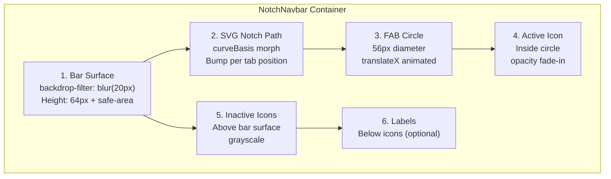

# Frontend Design Spec — NotchNavbar

## Overview

**Product:** Reusable bottom navigation bar component for Next.js/React (TypeScript) with animated notch + FAB pattern.
**Origin:** Port of Mindinventory's `react-native-tabbar-interaction` (Dribbble shot #4844696) to web.
**Audience:** Developers integrating a premium, animated bottom nav into web apps. End users on mobile-first PWA/SPA.
**Goals:**
- Pixel-faithful SVG notch sliding animation
- Accessible (WCAG AA minimum), RTL-ready, reduced-motion safe
- Light/dark theme via View Transition API
- Mobile-first, responsive up to desktop
- Reusable as npm-ready component

**Style Direction:** Modern dark glassmorphism with elevated FAB. Clean, minimal, cinematic.

---

## User Overrides

| User Preference | How Applied |
|-----------------|-------------|
| Glass/dark moderno | Dark theme primary; `backdrop-filter: blur()` on bar surface; semi-transparent backgrounds |
| Mobile-first | Component width adapts to viewport; safe-area insets respected |
| View Transition API for theme toggle | `document.startViewTransition()` on theme switch; CSS `@view-transition` for cross-fade |
| RTL-ready | All `translateX` mirrored via `[dir="rtl"]` or CSS logical properties |
| SCSS styling | All tokens as CSS custom properties; component styles in `.notch-navbar` namespace |

---

## Design System Summary

**Pattern:** Minimal Single Column (adapted for navigation component)
**Style:** Accessible & Ethical + Modern Dark (Cinema Mobile)
**Colors:** Token-driven light/dark palette (see Tokens section)
**Typography:** Inter (labels), system-ui fallback
**Effects:** SVG path morph, CSS `translateX` slide, opacity fade, `backdrop-filter` blur
**Anti-patterns to avoid:** Emoji icons, layout-shifting transforms, instant state changes, invisible focus

> Full design system: `design-system/notchnavbar/MASTER.md`

---

## Screen Inventory

| Screen | Purpose | Priority | Mockup |
|--------|---------|----------|--------|
| NotchNavbar Demo | Interactive showcase with 4 tabs | P0 | `Mockups/notch-navbar-demo.html` |
| Theme Toggle Demo | Light/dark switch with View Transition | P1 | `Mockups/theme-toggle-demo.html` |

---

## Component Anatomy

### Layer Stack (bottom to top)



### Dimensions

| Element | Size | Position | Notes |
|---------|------|----------|-------|
| **Container** | `width: 100%`, `height: 64px` + `env(safe-area-inset-bottom)` | `position: fixed; bottom: 0` | Sticks to viewport bottom |
| **Bar Surface** | `width: 100%`, `height: 64px` | Bottom of container | `backdrop-filter: blur(20px)`; rounded top corners `10px` |
| **SVG Notch** | `width: 100%`, `height: 64px` | Overlay on bar surface | Path with `curveBasis` bump; bump radius ~28px |
| **FAB Circle** | `56px × 56px` | Centered on active tab X; `bottom: 8px` (sits above bar) | `border-radius: 50%`; elevated shadow |
| **Icons (inactive)** | `24px × 24px` | Centered per tab column; `bottom: 16px` from bar top | Grayscale, 60% opacity |
| **Icon (active)** | `24px × 24px` | Inside FAB circle, centered | Full color, `opacity: 1` |
| **Labels (optional)** | `font-size: 10px` | Below icon center; `bottom: 4px` from bar bottom | Show on active tab only or all |

### Tab Grid Calculation

```
tabWidth = containerWidth / tabs.length
tabCenterX = tabWidth * (index + 0.5)
notchBumpCenterX = tabCenterX  (for active tab)
```

---

## States and Animations

### State Table

| State | translateX (FAB) | Notch Path | Icon Opacity | Duration | Easing | Trigger |
|-------|------------------|------------|--------------|----------|--------|---------|
| **Default (idle)** | `0` (at active tab) | Bump at active tab | Active: `1`, Others: `0.6` | — | — | Initial render |
| **Tab Switch** | `0` → `targetX` | Morph bump to new tab | Old: `1→0`, New: `0→1` | **350ms** | `cubic-bezier(0.16, 1, 0.3, 1)` | User tap/click |
| **Pressed** | Scale `0.95` on icon | — | — | **80ms** | `ease-out` | Pointer down |
| **Hover (desktop)** | Scale `1.05` on icon | — | Inactive: `0.6→0.8` | **150ms** | `ease` | Mouse enter |
| **Focus (keyboard)** | Ring `3px` around FAB or icon | — | — | **0ms** (instant) | — | Tab key |
| **Disabled** | — | — | All: `0.3` | — | — | `disabled` prop |
| **Reduced Motion** | Instant position change | No morph; static | Instant switch | **0ms** | — | `prefers-reduced-motion: reduce` |

### Animation Details

#### Tab Switch (primary animation)

```scss
// FAB slide
.notch-navbar__fab {
  transition: transform 350ms cubic-bezier(0.16, 1, 0.3, 1);
  // transform: translateX(calc(var(--active-index) * var(--tab-width)));
}

// SVG notch path morph
.notch-navbar__notch-path {
  transition: d 350ms cubic-bezier(0.16, 1, 0.3, 1);
  // d attribute animated via JS (flubber or GSAP MorphSVG)
}

// Icon crossfade
.notch-navbar__icon--active {
  transition: opacity 200ms ease-in 100ms; // delayed 100ms for stagger
}
.notch-navbar__icon--inactive {
  transition: opacity 150ms ease-out;
}
```

#### Reduced Motion Override

```scss
@media (prefers-reduced-motion: reduce) {
  .notch-navbar__fab,
  .notch-navbar__notch-path,
  .notch-navbar__icon {
    transition-duration: 0ms !important;
    animation: none !important;
  }
}
```

---

## Responsive Behavior

| Breakpoint | Container Width | Tab Count | Density | Behavior |
|------------|-----------------|-----------|---------|----------|
| **Mobile (320–479px)** | `100vw` (fluid) | 3–5 | Compact | Full animation; labels hidden |
| **Large Mobile (480–767px)** | `100vw` (fluid) | 3–5 | Standard | Full animation; labels visible on active |
| **Tablet (768–1023px)** | `max-width: 480px` centered | 3–5 | Standard | Full animation; labels visible |
| **Desktop (1024px+)** | `max-width: 480px` centered | 3–5 | Relaxed | Hover states; consider hiding (use sidebar nav) |

### Container Width Strategy

```scss
.notch-navbar {
  position: fixed;
  bottom: 0;
  left: 0;
  right: 0;
  width: 100%;
  max-width: 100vw;

  @media (min-width: 768px) {
    max-width: 480px;
    left: 50%;
    transform: translateX(-50%);
    border-radius: 16px 16px 0 0;
  }

  @media (min-width: 1024px) {
    // Optional: hide on desktop, show sidebar instead
    display: var(--navbar-desktop-visibility, flex);
  }
}
```

### Tab Count Constraints

| Tabs | Behavior |
|------|----------|
| 2 | FAB width adapts; wider bump radius |
| 3–4 | Optimal; default layout |
| 5 | Maximum; icons may shrink to 20px |
| 6+ | **Not supported** — use overflow/menu pattern |

---

## Theme Specification

### Light Mode Tokens

| Token | Value | Usage |
|-------|-------|-------|
| `--nn-bg-bar` | `rgba(255, 255, 255, 0.85)` | Bar surface background |
| `--nn-bg-fab` | `#FFFFFF` | FAB circle fill |
| `--nn-bg-page` | `#F8F9FA` | Page background (for contrast) |
| `--nn-color-icon-active` | `#007AFF` | Active icon inside FAB |
| `--nn-color-icon-inactive` | `#6B7280` | Inactive icons |
| `--nn-color-label` | `#374151` | Tab labels |
| `--nn-shadow-fab` | `0 4px 12px rgba(0, 0, 0, 0.15)` | FAB elevation |
| `--nn-shadow-bar` | `0 -2px 10px rgba(0, 0, 0, 0.05)` | Bar surface shadow |
| `--nn-color-notch` | `#FFFFFF` | SVG notch path fill |
| `--nn-border-bar` | `rgba(0, 0, 0, 0.06)` | Top border of bar |
| `--nn-color-focus-ring` | `#007AFF` | Focus ring color |

### Dark Mode Tokens

| Token | Value | Usage |
|-------|-------|-------|
| `--nn-bg-bar` | `rgba(10, 10, 12, 0.85)` | Bar surface background |
| `--nn-bg-fab` | `#1A1A2E` | FAB circle fill |
| `--nn-bg-page` | `#0A0A0C` | Page background |
| `--nn-color-icon-active` | `#60A5FA` | Active icon (lighter blue for contrast) |
| `--nn-color-icon-inactive` | `#9CA3AF` | Inactive icons |
| `--nn-color-label` | `#E5E7EB` | Tab labels |
| `--nn-shadow-fab` | `0 4px 16px rgba(96, 165, 250, 0.2)` | FAB glow shadow |
| `--nn-shadow-bar` | `0 -2px 10px rgba(0, 0, 0, 0.3)` | Bar surface shadow |
| `--nn-color-notch` | `#1A1A2E` | SVG notch path fill |
| `--nn-border-bar` | `rgba(255, 255, 255, 0.08)` | Top border of bar |
| `--nn-color-focus-ring` | `#60A5FA` | Focus ring color |

### View Transition API Toggle

```typescript
// Theme toggle function
function toggleTheme() {
  if (!document.startViewTransition) {
    document.documentElement.dataset.theme = 
      document.documentElement.dataset.theme === 'dark' ? 'light' : 'dark';
    return;
  }
  
  document.startViewTransition(() => {
    document.documentElement.dataset.theme = 
      document.documentElement.dataset.theme === 'dark' ? 'light' : 'dark';
  });
}
```

```css
/* View Transition cross-fade */
::view-transition-old(root),
::view-transition-new(root) {
  animation-duration: 300ms;
  animation-timing-function: cubic-bezier(0.16, 1, 0.3, 1);
}
```

---

## Accessibility

### ARIA Pattern

```html
<nav 
  class="notch-navbar" 
  role="navigation" 
  aria-label="Main navigation"
  data-theme="dark"
>
  <div class="notch-navbar__surface">
    <!-- SVG notch layer -->
    <svg class="notch-navbar__svg" aria-hidden="true">
      <path class="notch-navbar__notch-path" />
    </svg>
    
    <!-- FAB (decorative — focus goes to tab button) -->
    <div class="notch-navbar__fab" aria-hidden="true">
      <span class="notch-navbar__fab-icon"><!-- Active icon --></span>
    </div>
    
    <!-- Tab list -->
    <ul class="notch-navbar__tabs" role="tablist">
      <li role="none">
        <button
          role="tab"
          aria-selected="true"
          aria-label="Home"
          tabindex="0"
          class="notch-navbar__tab"
        >
          <span class="notch-navbar__icon" aria-hidden="true"><!-- SVG icon --></span>
          <span class="notch-navbar__label">Home</span>
        </button>
      </li>
      <!-- ... more tabs -->
    </ul>
  </div>
</nav>
```

### Keyboard Interaction

| Key | Action |
|-----|--------|
| `Tab` | Move focus into navbar; first tab gets focus |
| `←` / `→` | Navigate between tabs (roving tabindex) |
| `Enter` / `Space` | Activate focused tab |
| `Home` | Focus first tab |
| `End` | Focus last tab |

### Focus Management

```scss
.notch-navbar__tab {
  &:focus-visible {
    outline: 3px solid var(--nn-color-focus-ring);
    outline-offset: 2px;
    border-radius: 8px;
  }
  
  // Remove default outline, keep custom
  &:focus:not(:focus-visible) {
    outline: none;
  }
}
```

### Touch Targets

- Minimum interactive area: **44px × 44px** (iOS) / **48px × 48dp** (Android equivalent)
- Icon is 24px but button padding expands hit area to 48px
- Minimum gap between adjacent tabs: **8px**

### Reduced Motion

```scss
@media (prefers-reduced-motion: reduce) {
  .notch-navbar {
    // All transitions instant
    *, *::before, *::after {
      transition-duration: 0ms !important;
      animation-duration: 0ms !important;
    }
    
    // FAB jumps to position (no slide)
    &__fab {
      transform: translateX(var(--target-x));
    }
    
    // No SVG morph; static notch
    &__notch-path {
      d: path(var(--static-notch-path));
    }
  }
}
```

### RTL Support

```scss
[dir="rtl"] .notch-navbar {
  // Mirror X translations
  &__fab {
    transform: translateX(calc(-1 * var(--fab-x)));
  }
  
  // Tab order reversal handled by flex-direction: row-reverse
  &__tabs {
    flex-direction: row-reverse;
  }
  
  // SVG path mirrored
  &__svg {
    transform: scaleX(-1);
  }
}
```

---

## Recommended Usage

### Integration in Layout

```tsx
// app/layout.tsx (Next.js App Router)
export default function RootLayout({ children }) {
  return (
    <html lang="en" data-theme="dark">
      <body>
        <main style={{ paddingBottom: 'calc(64px + env(safe-area-inset-bottom))' }}>
          {children}
        </main>
        <NotchNavbar tabs={tabs} />
      </body>
    </html>
  );
}
```

### Safe Area Handling

```scss
.notch-navbar {
  padding-bottom: env(safe-area-inset-bottom, 0px);
  
  // iOS requires meta tag:
  // <meta name="viewport" content="viewport-fit=cover" />
}
```

### Z-Index Strategy

| Layer | z-index | Notes |
|-------|---------|-------|
| Page content | `0` | Default |
| NotchNavbar | `1000` | Fixed above content |
| Modals/Dialogs | `2000` | Above navbar |
| Toast/Notifications | `3000` | Above everything |

### Safe Area CSS

```scss
// Content padding to prevent overlap
.page-content {
  padding-bottom: calc(64px + env(safe-area-inset-bottom, 0px) + 16px);
}
```

---

## Do / Don't

### Do

| Practice | Reason |
|----------|--------|
| Use SVG icons (Lucide, Phosphor) | Scalable, themeable, no emoji inconsistency |
| Animate `transform` and `opacity` only | GPU-accelerated, 60fps |
| Provide `aria-label` on every tab | Screen reader announces purpose |
| Test with `prefers-reduced-motion: reduce` | Users with vestibular disorders |
| Use CSS custom properties for theming | Runtime toggle without re-render |
| Add `will-change: transform` on FAB | Hints GPU layer promotion |
| Use `cubic-bezier(0.16, 1, 0.3, 1)` | Natural deceleration (expo.out feel) |
| Respect `env(safe-area-inset-bottom)` | iPhone notch/home indicator |

### Don't

| Anti-pattern | Why |
|--------------|-----|
| Animate `left`/`top`/`margin` | Triggers layout reflow, jank |
| Use `setTimeout` for animation timing | Use CSS transitions or `requestAnimationFrame` |
| Put emoji as icon content | Font-dependent, inconsistent, not themeable |
| Use `<div onClick>` for tabs | Not keyboard accessible, no semantic role |
| Animate SVG `d` attribute without polyfill | Browser support varies; use flubber/GSAP |
| Hardcode colors in component | Breaks theming; use CSS variables |
| Nest interactive elements inside tabs | Screen reader confusion |
| Use `!important` in production styles | Specificity wars; refactor instead |
| Skip focus-visible styles | Keyboard users can't see where they are |
| Animate on `scroll` event without throttle | 60fps killer; use IntersectionObserver |

---

## Tokens (CSS Custom Properties)

### Full Token Table

| Token | Light | Dark | Usage |
|-------|-------|------|-------|
| `--nn-bg-bar` | `rgba(255,255,255,0.85)` | `rgba(10,10,12,0.85)` | Bar surface |
| `--nn-bg-fab` | `#FFFFFF` | `#1A1A2E` | FAB circle |
| `--nn-bg-page` | `#F8F9FA` | `#0A0A0C` | Page bg |
| `--nn-color-icon-active` | `#007AFF` | `#60A5FA` | Active icon |
| `--nn-color-icon-inactive` | `#6B7280` | `#9CA3AF` | Inactive icons |
| `--nn-color-label` | `#374151` | `#E5E7EB` | Labels |
| `--nn-shadow-fab` | `0 4px 12px rgba(0,0,0,0.15)` | `0 4px 16px rgba(96,165,250,0.2)` | FAB shadow |
| `--nn-shadow-bar` | `0 -2px 10px rgba(0,0,0,0.05)` | `0 -2px 10px rgba(0,0,0,0.3)` | Bar shadow |
| `--nn-color-notch` | `#FFFFFF` | `#1A1A2E` | Notch fill |
| `--nn-border-bar` | `rgba(0,0,0,0.06)` | `rgba(255,255,255,0.08)` | Bar border |
| `--nn-color-focus-ring` | `#007AFF` | `#60A5FA` | Focus ring |
| `--nn-radius-bar` | `10px` | `10px` | Bar top radius |
| `--nn-radius-fab` | `50%` | `50%` | FAB shape |
| `--nn-size-fab` | `56px` | `56px` | FAB diameter |
| `--nn-size-icon` | `24px` | `24px` | Icon size |
| `--nn-height-bar` | `64px` | `64px` | Bar height |
| `--nn-duration-slide` | `350ms` | `350ms` | FAB slide |
| `--nn-duration-fade` | `200ms` | `200ms` | Icon fade |
| `--nn-easing-slide` | `cubic-bezier(0.16,1,0.3,1)` | `cubic-bezier(0.16,1,0.3,1)` | Slide curve |
| `--nn-easing-fade` | `ease-in` | `ease-in` | Fade curve |
| `--nn-backdrop-blur` | `20px` | `20px` | Glass blur |
| `--nn-tab-count` | `4` | `4` | Dynamic via JS |

---

## Handoff → frontend-agent

### What to Implement

1. **Component:** `<NotchNavbar tabs={Tab[]} activeIndex={number} onTabChange={(i) => void} />`
2. **Tab type:** `{ id: string; label: string; icon: ReactNode; href?: string }`
3. **SVG notch generation:** Use `d3-shape` `curveBasis` or pre-computed path data per tab position
4. **FAB animation:** CSS `transform: translateX()` with `transition`; JS calculates `targetX`
5. **Icon crossfade:** `opacity` transition with stagger delay
6. **Theme toggle:** `document.startViewTransition()` wrapper
7. **RTL:** Mirror via `[dir="rtl"]` selector or CSS logical properties
8. **SCSS tokens:** All `--nn-*` variables in `tokens.scss`; import once

### File Structure Suggestion

```
src/
├── components/
│   └── NotchNavbar/
│       ├── NotchNavbar.tsx
│       ├── NotchNavbar.module.scss
│       ├── NotchNavbar.types.ts
│       ├── NotchPath.tsx        # SVG path generator
│       ├── NotchFab.tsx         # FAB circle + icon
│       ├── NotchTab.tsx         # Single tab button
│       └── hooks/
│           ├── useNotchPosition.ts
│           └── useRovingTabindex.ts
├── styles/
│   └── tokens/
│       └── notch-navbar.scss    # --nn-* variables
└── utils/
    └── notchPath.ts             # SVG d attribute generator
```

### States to Handle in UI

| State | UI Behavior |
|-------|-------------|
| **Loading** | Skeleton bar (gray rectangle) |
| **Empty** | Don't render navbar |
| **Error** | Fallback to simple text links |
| **Single tab** | No animation; centered FAB |
| **Overflow (6+ tabs)** | Show first 4 + "More" overflow menu |

---

## Doubts / Clarifications Needed

| # | Question | Context | Priority |
|---|----------|---------|----------|
| 1 | Should the component support Next.js App Router `<Link>` for tab navigation, or only callback-based `onTabChange`? | Affects whether tabs are `<a>` or `<button>` | high |
| 2 | Is `d3-shape` an acceptable dependency for SVG path generation, or should we pre-compute paths for 2–5 tab configs? | Bundle size vs. flexibility | high |
| 3 | Should the component support SSR (server component) or is client-only (`"use client"`) acceptable? | Animation requires client-side JS | medium |
| 4 | What is the maximum tab count to support? 5 is standard; 6+ needs overflow pattern. | Layout math and accessibility | medium |
| 5 | Should the FAB circle contain only the icon, or also support a badge/counter? | Extensibility | low |
| 6 | Is `backdrop-filter` acceptable for the glass effect? Safari/iOS support is good but Firefox was late. | Progressive enhancement | medium |
| 7 | Should the component ship as a standalone npm package, or integrated into an existing design system? | Affects token naming and theming approach | low |

---

## Appendix: SVG Notch Path Reference

### Path Generation Logic (from original repo)

```
Tab center X = (tabWidth * index) + (tabWidth / 2)
Notch bump = half-circle radius ~28px centered at tabCenterX

Path segments:
  M 0,0                           // Top-left start
  L (tabCenterX - 30),0           // Line to bump start
  C curveBasis points...          // Curve bump (half-circle up)
  L containerWidth,0              // Continue to top-right
  L containerWidth,height         // Down right side
  L 0,height                      // Across bottom
  Z                               // Close path
```

### Easing Reference

| Name | CSS | Feel |
|------|-----|------|
| expo.out | `cubic-bezier(0.16, 1, 0.3, 1)` | Fast start, slow deceleration (recommended for slide) |
| ease-in-out | `cubic-bezier(0.42, 0, 0.58, 1)` | Symmetric (fallback) |
| spring (approx) | `cubic-bezier(0.34, 1.56, 0.64, 1)` | Slight overshoot (optional playful feel) |

---

*Generated: 2026-08-01 | Skill: ui-ux-pro-max | Design System: design-system/notchnavbar/MASTER.md*
